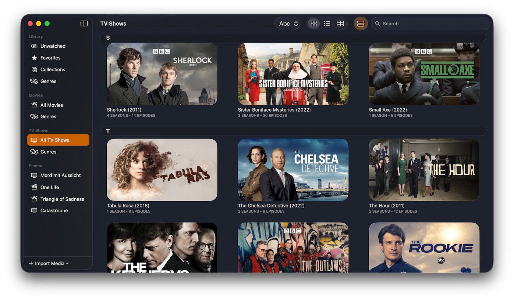

<h1 align="center">MyMedia</h1>

MyMedia is a simple app written purely in SwiftUI for displaying your local movie and TV show library.
It is supposed to be an alternative to Apples TV app, as it lacks a lot of functionality for local media.

  

    
    
    
    
    
    
  

  

    
    
  

## Library 
You can import Media files into MyMedia. All data is read from the included metadata of the file.
I recommend [Subler](https://github.com/SublerApp/Subler) for metadata editing.

It is currently not supported and planned to edit metadata directly in MyMedia.

## Features
 - Display your media library gorgeously with Artworks and details about the movie or show.
 - Play with the included player or with the system default app.
 - Tracking of unwatched movies and TV shows and episodes.
 - Create collections of your shows and movies.
 - Pinning and favoriting of media.
 - Separate genres for TV shows and Movies.
 - Languages
    - English
    - German

## Installation
 1. Open [Releases](https://github.com/photangralenphie/MyMedia/releases/) and download the latest MyMedia.dmg
 2. Open the downloaded file
 3. Drag MyMedia into the Applications folder.

## Roadmap
These features are currently planned (not in a particular order):
 - [x] ~~Collections: Group several movies or TV Shows together.~~ (V1.1)
 - [x] ~~update Metadata after changes made to the original file.~~ (V1.1)
 - [x] ~~Episode Detail: A nice detail page for a single episode of a TV show.~~ (V2.0)
 - [x] ~~List and List-Detail Views.~~ (V2.0)
 - [ ] Library Search: Searching the complete library including all metadata.
 - [ ] Recent Tab: A view to show recently added Movies, TV Shows and episodes.
 - [ ] Support for more file types.
 - [ ] better support for vertical artwork

## Requirements
 - macOS 15 or higher

## Contributing
See [CONTRIBUTING.md](CONTRIBUTING.md)

## License
MIT - See [LICENSE](LICENSE) for details.
